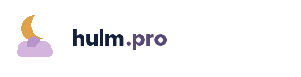
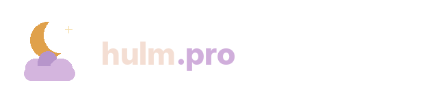
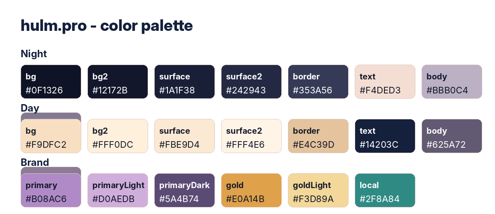

# hulm.pro - Brand Guide v1.0

**Cel:** świat arabskojęzyczny / MENA jako bliska siostra sennik.tv: nocne niebo, miękkie światło Księżyca, spokojny głos, ciepłe karty i prosty search-first UX.

## 1. Esencja marki

`hulm.pro` ma wyglądać jak lokalna wersja sennik.tv, nie jak zupełnie nowy produkt. Zostawiamy DNA: noc/dzień, gwiazdy, kartowy blog, duży hero z pytaniem, miękkie obrysy i kolorystykę lawendowo-złotą. Adaptacja arabska powinna używać kierunku RTL, subtelnych motywów hilal/qamar i drobnej geometrii gwiazd. Nie idziemy w religijność, wróżbiarstwo ani ciężką kaligrafię - to nadal spokojna, nowoczesna siostra sennik.tv.

**Pozycjonowanie:** Spokojny, nowoczesny słownik snów po arabsku, oparty o jasne interpretacje, nie fatalizm.

**Obietnica:** Pomagamy opisać symbole i emocje ze snów w języku prostym, ciepłym i kulturowo uważnym.

## 2. Nazwa i domena

- Komunikacyjnie i technicznie: `hulm.pro`.
- W logotypie: lowercase, bez wielkich liter i bez agresywnych kontrastów.
- Domena jest krótka, dlatego logo powinno zostać bardzo proste i bliskie sennik.tv.
- Lokalny opis marki: `قاموس أحلام هادئ وواضح.`.

### RTL i arabski lockup

- HTML strony powinien mieć `lang="ar" dir="rtl"`.
- Search, karty i footer są wyrównane do prawej, ale rytm spacingu zostaje taki jak w sennik.tv.
- Pełne logo domenowe pozostaje `hulm.pro`; opcjonalny lockup `حُلْم.pro` można używać w socialach lub nagłówkach editorialnych.
- Unikać mieszania ciężkiej kaligrafii z małym UI - nawigacja i formularze mają być bardzo czytelne.

## 3. Logo

Logo jest bliskie sennik.tv: symbol półksiężyca nad chmurą oraz lowercase wordmark. Adaptacja lokalna ma być subtelna: lowercase w domenie, z opcjonalnym arabskim lockupem editorialnym حُلْم; nie mieszać ciężkiej kaligrafii z UI.

### Wersje

- `assets/logo/logo-day.svg` - podstawowa wersja na jasnym tle.
- `assets/logo/logo-night.svg` - wersja na ciemnym tle.
- `assets/logo/mark.svg` - sam znak do favicon, avatarów, UI i social.
- `assets/logo/wordmark-day.svg` oraz `wordmark-night.svg` - wordmark bez symbolu.
- `assets/logo/og-image.png` - social preview 1200 x 630.

### Zasady

- Clearspace: minimum wysokość półksiężyca z każdej strony.
- Minimalna szerokość pełnego logo w web: 132 px.
- Minimalna szerokość symbolu: 24 px.
- Nie rozciągać, nie obracać, nie dodawać neonowego glow.
- Nie używać lokalnych symboli w sposób dosłowny lub polityczny.
- Na tle zdjęciowym używać półprzezroczystej karty albo wersji nocnej.

## 4. Kolorystyka

### Tryb nocny

| Token | HEX | Użycie |
|---|---:|---|
| `--hp-bg` | `#0F1326` | główne tło nocne |
| `--hp-bg-2` | `#12172B` | gradient / drugi plan |
| `--hp-surface` | `#1A1F38` | karty i inputy |
| `--hp-border` | `#353A56` | obrysy |
| `--hp-text` | `#F4DED3` | nagłówki |
| `--hp-body` | `#BBB0C4` | akapity |
| `--hp-primary` | `#B08AC6` | aktywne stany |
| `--hp-gold` | `#E0A14B` | Księżyc i gwiazdy |

### Tryb dzienny

| Token | HEX | Użycie |
|---|---:|---|
| `--hp-bg` | `#F9DFC2` | główne tło dzienne |
| `--hp-bg-2` | `#FFF0DC` | jaśniejszy gradient |
| `--hp-surface` | `#FBE9D4` | karty i inputy |
| `--hp-border` | `#E4C39D` | obrysy |
| `--hp-text` | `#14203C` | nagłówki |
| `--hp-body` | `#625A72` | akapity |

### Akcent lokalny

Oasis teal `#2F8A84` - używać w avatarze, małych badge i akcentach danych. Geometria i półksiężyc są subtelne, nie dekoracyjne na siłę.

## 5. Typografia

Rekomendowany stack: `Noto Sans Arabic, IBM Plex Sans Arabic, Tajawal, Inter, system-ui, sans-serif`.

Sprawdzić ligatury, kerning i interpunkcję RTL; HTML powinien mieć `lang="ar" dir="rtl"`.

Hierarchia:

- H1 hero: 56-72 px desktop, 42-48 px mobile, ExtraBold, tracking -2% do -5%.
- H2 strony: 34-44 px, ExtraBold.
- Body: 16-18 px, line-height 1.6.
- Meta/kicker: 12-13 px, uppercase/semibold, tracking 8% dla alfabetu łacińskiego; dla arabskiego bez przesadnego letter-spacingu.

## 6. Język marki

Marka mówi spokojnie i jasno. Nie straszy, nie obiecuje przepowiedni, nie używa kategorycznych diagnoz.

Używać:

- `قد يدل على`
- `يمكن أن يشير إلى`
- `غالباً`
- `أحياناً`
- `قراءة محتملة`

Unikać:

- `سيحدث لك حتماً`
- `مصيرك`
- `لعنة`
- `نبوءة مؤكدة`
- `لا شك أن`

## 7. UI i layout

### Nawigacja

`المدوّنة`, `الألوان`, `الأرقام`, `الأبراج`, `طور القمر`

Desktop: logo po jednej stronie, nav centralnie, przełącznik dzień/noc po drugiej. Mobile: logo + hamburger, przełącznik trybu w drawerze.

### Hero

H1: `ماذا يعني حلمك؟`

Lead: `اكتب ما رأيت في حلمك - كلمة واحدة أو مشهداً كاملاً. ستجد تفسيرات واضحة ومطمئنة للرموز والتركيبات مثل 'كلب أسود' أو 'ثعبان في الماء'.`

Placeholder: `احكِ حلمك...`

### Search input

- Border 2 px w lawendzie.
- Ring 5 px z lawendą 18% opacity.
- Radius 22 px.
- Wysokość desktop 62 px, mobile 56 px.
- Po focusie ring mocniejszy i delikatny cień.

### Karty blogowe

- Radius 18 px.
- Obraz 260 x 172 px w desktopie.
- Treść: kicker, tytuł, opis, meta.
- Meta lokalna, np. z datą i czasem czytania.

Przykłady artykułów:

- **ماذا يعني الحلم بشريك سابق؟** - قد يظهر الشريك السابق في الحلم فتستيقظ مع مشاعر كثيرة. هذه قراءة هادئة لا تخوّف ولا تقدّم وعوداً حاسمة. (5 يوليو 2026 · 7 دقائق قراءة)
- **لماذا نحلم بمن رحلوا؟** - أحلام الأحبة الراحلين قد تبدو واقعية جداً. نقرأها من زاوية الذاكرة والارتباط والاشتياق، لا من زاوية الخوف. (4 يوليو 2026 · 6 دقائق قراءة)
- **لماذا ننسى أحلامنا وكيف نتذكرها؟** - يختفي الحلم أحياناً قبل أن نفتح أعيننا جيداً. هذه عادات بسيطة تساعدك على تذكّر الصور الليلية مدة أطول. (4 يوليو 2026 · 7 دقائق قراءة)

## 8. Ilustracje

Styl powinien pozostać jak w sennik.tv: książkowy, miękki, nocny, z dużym Księżycem. Lokalność nie wymaga oczywistych motywów.

Do:

- duży Księżyc albo półksiężyc jako spokojne światło
- delikatna geometria gwiazd i miękkie łuki
- ciepły beż, daktylowe złoto, nocna lawenda
- neutralne sylwetki i domowe sceny

Don't:

- nadmiar religijnych lub politycznych symboli
- ciężka kaligrafia w całym UI
- fatalizm, przepowiednie, straszenie
- orientalistyczne stereotypy i stockowe pustynie

## 9. SEO i content

Przykładowe kierunki stron:

- `حلم كلب أسود` -> `/tafsir-hulm-kalb-aswad` -> حلم كلب أسود: معانٍ محتملة وقراءة هادئة
- `حلم ثعبان في الماء` -> `/tafsir-hulm-thuban-fi-al-maa` -> حلم ثعبان في الماء: ماذا يمكن أن يشير؟
- `حلم سقوط الأسنان` -> `/tafsir-hulm-suqut-al-asnan` -> حلم سقوط الأسنان: قلق، تغير أم حاجة للعناية؟

Zasada: tytuły mają brzmieć jak pomocna interpretacja, nie jak wyrok. Długie frazy i kombinacje symboli są ważniejsze niż krótkie hasła ogólne.

## 10. Implementacja

W paczce są gotowe pliki:

- `assets/css/hulm-theme.css` - zmienne kolorystyczne i layout bazowy.
- `assets/css/hulm-components.css` - przyciski, footer i drobne komponenty.
- `assets/tokens/design-tokens.json` - tokeny do Figma/Tokens Studio lub dev handoff.
- `assets/html/homepage-night-preview.html` - przykład strony w trybie nocnym.
- `assets/html/blog-day-preview.html` - przykład listy blogowej w trybie dziennym.
- `ui/mockups/homepage-night.png` i `ui/mockups/blog-day.png` - statyczne makiety do handoffu.

## 11. Checklist launch

- Logo w SVG i PNG podpięte w headerze.
- Favicon `assets/favicon/site-icon.svg` i PNG 512.
- `lang="ar"` w HTML; dla RTL również `dir="rtl"`.
- Tryby `day` i `night` testowane na mobile.
- Focus inputu widoczny klawiaturą.
- Karty mają alt text albo puste alt, jeśli obraz jest dekoracyjny.
- Ton tekstów: spokojny, pomocny, bez straszenia.
- Fonty testowane pod lokalne znaki i realne dane.
